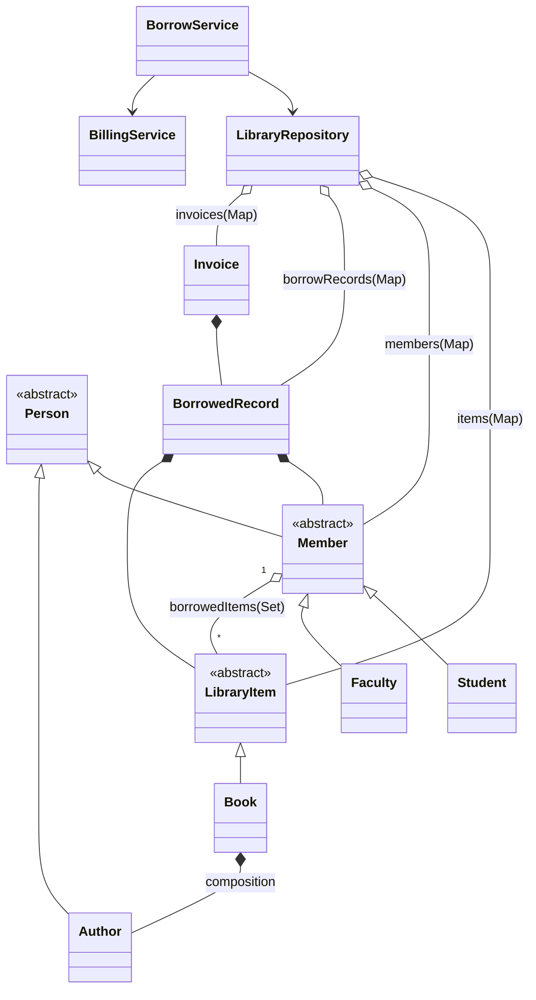

# Kutuphane Uygulamasi (Console) - MVP Plan

Bu plan, repodaki mevcut dosya agacini (ozellikle `src/com/workintech/library/*`) baz alarak, `README.md` isterlerini karsilayan ama gereksiz komplekslesmeyen bir "Kutuphane Otomasyonu" MVP'si cikarmayi hedefler. Referans diyagram: `challenge1.png`.

## Kapsam ve MVP Sinirlari

- Uygulama tipi: Konsol uygulamasi (Scanner).
- Veri saklama: Sadece bellek ici (in-memory). Dosya/DB yok.
- Odunc ve faturalandirma: Basit bir "emanet alma/teslim" akisi + "fatura kes / iade et" kaydi.
- Hedef: OOP kavramlarini (encapsulation, composition, inheritance, abstract/interface, polymorphism) pratik etmek.

## Mevcut Proje Agaci (Ozet)

- `app/`: Giris noktasi (`Main.java`) ve menuler.
- `domain/`: Temel model siniflari (`Person`, `Member`, `Student`, `Faculty`, `Author`, `LibraryItem`, `Book`, `Category`, `ItemStatus`, `BorrowedRecord`).
- `repository/`: Veri saklama ve arama (`LibraryRepository`).
- `service/`: Is kurallari (su an `BorrowService` bos).
- `billing/`, `exception/`: Su an bos; MVP icin minimal siniflar eklenecek.

Not: `Faculty.java` dosyasinda method imzasi uyumsuz gorunuyor (`getMaxLimit()` var, `Member` ise `getBorrowedLimit()` istiyor). Planin ilk teknik adimlarindan biri bu uyumsuzlugu duzeltmek.

## Isterler -> Nerede Karsilanacak?

- OOP tasarim: `domain + service + repository` paketleri.
- Encapsulation: Tum alanlar `private`, erisim `getter`/kontrollu methodlar ile.
- Composition: `Book` icinde `Author`; `BorrowedRecord` icinde `Member` + `LibraryItem`; `Invoice` icinde `BorrowedRecord`.
- Inheritance: `Person -> Member -> Student/Faculty`, `LibraryItem -> Book`.
- Abstract/Interface: `Person` ve `LibraryItem` zaten `abstract`. (MVP'de ek olarak `BillingPolicy` interface opsiyonel.)
- Polymorphism: `LibraryItem` uzerinden calis (list/search/borrow), `getItemType()` ile farkli turler.
- List + Set + Map:
  - Map: `LibraryRepository.items`, `members`, `borrowRecords`, `invoices`
  - Set: `Member.borrowedItems`, `LibraryRepository.availableCategories`
  - List: `LibraryRepository.getAllItems()` (ve listeleme ekranlari)
- Minimum 10 sinif: Zaten mevcut (10+). MVP icin 2-3 tane daha eklenebilir (Invoice, BillingService, custom exception).

## Hedef Domain Modeli (MVP)

### Domain (domain/)

- `Person (abstract)`: `id`, `name`, `getRole()`
  - Ister: Encapsulation, inheritance, abstract
- `Author extends Person`: Yazar bilgisi
  - Ister: inheritance
- `Member (abstract) extends Person`: Odunc alan kisi; `borrowedItems` (Set), limit
  - Ister: abstract, set kullanimi, encapsulation
- `Student extends Member`: Limit 5
  - Ister: inheritance, polymorphism (Member referansi ile)
- `Faculty extends Member`: Limit (ornek 10)
  - Ister: inheritance, polymorphism
- `LibraryItem (abstract)`: `id`, `title`, `price`, `status`, `getItemType()`
  - Ister: abstract, encapsulation, polymorphism
- `Book extends LibraryItem`: `isbn`, `Author`, `Category`
  - Ister: composition (`Author`), inheritance
- `Category (enum)`: Kategori
  - Ister: kategoriye gore listeleme, set (kategori havuzu)
- `ItemStatus (enum)`: AVAILABLE/BORROWED
  - Ister: odunc alinmis mi kontrolu
- `BorrowedRecord`: Bir item kimde, ne zaman alindi/teslim edildi
  - Ister: "hangi kitap hangi kullanicida" bilgisini tutma

### Repository (repository/)

- `LibraryRepository`:
  - `Map<Integer, LibraryItem> items`
  - `Map<Integer, Member> members`
  - `Map<Integer, BorrowedRecord> borrowRecordsByItemId`
  - `Map<Integer, Invoice> invoicesByRecordId` (veya itemId)
  - Arama/Listeleme methodlari: id, title, author, category
  - Ister: Map kullanimi + listeleme/arama altyapisi

### Service (service/)

- `BorrowService`:
  - Kurallar: item musait mi, uye limiti dolu mu, odunc kaydi olustur, status guncelle, iade et
  - Ister: odunc alma/teslim, limit (5), esnek/polymorphic calisma

### Billing (billing/)

- `Invoice` (domain gibi davranan basit sinif): `id`, `recordId`, `memberId`, `itemId`, `amount`, `status(PAID/REFUNDED)`
- `BillingService`: odunc aninda invoice create/paid, iade aninda refund
  - Ister: "kitap alindiginda fatura kes" + "iade edince iade"

### Exception (exception/)

- `NotFoundException`, `BusinessRuleException` (veya tek bir `LibraryException`)
  - Ister: Konsol uygulamasinda kontrollu hata mesaji ve basit akis

## Diyagram (Markdown icinde cizim)

Mermaid ile hiyerarsi ve temel iliskiler:

## Gelistirme Plani (Adim Adim)

Her adimda hedef, dokunulacak siniflar ve hangi isterleri karsiladigi belirtilmistir. Adimlar kucuk tutuldu; her adim sonunda uygulamayi calistirip menuden deneme yapilabilir.

1. Derlenebilir hale getir (Iskeleti toparla)
   - Amac: Mevcut kodun compile olmasi ve temel modelin netlesmesi.
   - Siniflar:
     - `domain/Faculty`: `getBorrowedLimit()` imzasina uydur (Member ile uyum).
     - `domain/BorrowedRecord`: alanlari + constructor + getter/setter veya kontrollu methodlar.
   - Ister: Encapsulation + inheritance zinciri saglikli olsun.

2. Repository arama/listeleme fonksiyonlarini tamamla
   - Amac: CRUD ve arama icin tek veri giris noktasi.
   - Siniflar:
     - `repository/LibraryRepository`:
       - `findBooksByTitle(String)` (list)
       - `findBooksByAuthorName(String)` (list)
       - `getBooksByCategory(Category)` (list)
       - `updateItem(...)` (basit: title/price/isbn/category guncelleme)
   - Ister: id/isim/yazar ile secme, kategori/yazar listeleme, list kullanimi.

3. BorrowService (odunc alma/teslim) is kurallarini yaz
   - Amac: Kurallari UI'dan ayir (service katmani).
   - Siniflar:
     - `service/BorrowService`:
       - `borrowItem(memberId, itemId)`
       - `returnItem(memberId, itemId)`
       - kural kontrolleri:
         - item var mi?
         - uye var mi?
         - item AVAILABLE mi?
         - uye limit dolu mu? (`member.getBorrowedItems().size() < member.getBorrowedLimit()`)
       - `BorrowedRecord` olustur/sakla, item status guncelle
   - Ister: odunc alma/teslim, "hangi kitap kimde" kaydi, limit 5, polymorphism (Member/LibraryItem referansi ile).

4. Billing (fatura kes + iade) MVP'si
   - Amac: Odunc alinca ucret kes, iade edince iade et (kayit).
   - Siniflar:
     - `billing/Invoice`, `billing/BillingService`
     - `BorrowService` icinde borrow/return akislari billing'i cagirsin.
   - Ister: fatura kesme ve iade etme.

5. Console UI (Main) menusu: CRUD + arama + odunc/iade
   - Amac: README'deki minimum aksiyonlari menulerle kullanilabilir hale getirmek.
   - Siniflar:
     - `app/Main`:
       - Menu: (1) kitap ekle (2) kitap ara (id/title/author) (3) kitap guncelle (4) kitap sil
       - Menu: (5) kategoriye gore listele (6) yazara gore listele
       - Menu: (7) uye ekle (Student/Faculty) (8) odunc al (9) iade et
       - Menu: (10) rapor: kimde hangi kitap var + faturalar
   - Ister: konsol uygulamasi, tum minimum fonksiyonlar.

6. Hata yonetimi ve temiz cikislar
   - Amac: Kullanici yanlis girislerinde programin patlamamasi.
   - Siniflar:
     - `exception/*` + Main tarafinda try/catch
   - Ister: pratik OOP + temiz akis.

7. Son kontrol: Ister checklist + mini demo senaryosu
   - Amac: Isterlerin tamamini calisir sekilde gostermek.
   - Cikti:
     - `plan.md` checklist'i isaretle
     - Main uzerinden 1-2 dakikalik demo akisi

## Checklist (Tamamlandi Takibi)

- [ ] 1. `Faculty` method imzasini duzelt (compile)
- [ ] 1. `BorrowedRecord` alan/constructor/methodlarini tamamla
- [ ] 2. `LibraryRepository` arama: id + title + author
- [ ] 2. `LibraryRepository` CRUD: add/update/remove
- [ ] 2. Listeleme: kategoriye gore tum kitaplar
- [ ] 2. Listeleme: yazara gore tum kitaplar
- [ ] 3. `BorrowService.borrowItem` kurallari (musaitlik + limit)
- [ ] 3. `BorrowService.returnItem` kurallari + status guncelleme
- [ ] 3. "Hangi kitap kimde" kaydi (Map ile)
- [ ] 4. `Invoice` modeli
- [ ] 4. `BillingService` odunc aninda fatura kes (PAID)
- [ ] 4. `BillingService` iade aninda iade et (REFUNDED)
- [ ] 5. `Main` menu: kitap ekle
- [ ] 5. `Main` menu: kitap ara (id/title/author)
- [ ] 5. `Main` menu: kitap guncelle
- [ ] 5. `Main` menu: kitap sil
- [ ] 5. `Main` menu: kategoriye gore listele
- [ ] 5. `Main` menu: yazara gore listele
- [ ] 5. `Main` menu: uye ekle (Student/Faculty)
- [ ] 5. `Main` menu: odunc al + iade et
- [ ] 6. Exception/try-catch ile kullanici hatalarini yakala
- [ ] 7. Demo senaryosu calisiyor

## Calisma Senaryosu (Adim Adim)

1. Program acilir, menu gelir.
2. Kutuphaneye 2 kitap eklenir:
   - "1984" (Author: George Orwell, Category: FICTION, price: 50)
   - "Clean Code" (Author: Robert C. Martin, Category: TECHNOLOGY, price: 120)
3. Bir uye eklenir:
   - Student: "Ayse" (limit 5)
4. Kullanici kitap arar:
   - id ile (ornegin 1)
   - baslik ile ("Clean")
   - yazar adi ile ("Orwell")
5. Kategoriye gore listeleme yapilir:
   - TECHNOLOGY altindaki kitaplar gorulur.
6. Yazarina gore listeleme yapilir:
   - George Orwell'in kitaplari gorulur.
7. Odunc alma denenir:
   - Ayse, "1984" kitabini odunc alir.
   - Sistem:
     - Kitabin statusunu BORROWED yapar.
     - `BorrowedRecord` olusturur (itemId -> memberId).
     - Ayse'nin `borrowedItems` setine kitabi ekler.
     - Fatura keser (Invoice: PAID).
8. Ayni kitap baska biri tarafindan odunc alinmak istenir:
   - Sistem "kitap musait degil" hatasi verir.
9. Limit kontrolu:
   - Ayse 5 kitaba ulasirsa 6. odunc isteginde sistem reddeder.
10. Iade:
   - Ayse "1984" kitabini iade eder.
   - Sistem:
     - status AVAILABLE yapar,
     - kaydi "returned" yapar veya record'u kapatir,
     - faturayi REFUNDED yapar (ucret iadesi).
11. Kitap guncelleme:
   - "Clean Code" fiyat/ISBN/kategori guncellenir.
12. Kitap silme:
   - Musait (AVAILABLE) bir kitap sistemden silinir.

